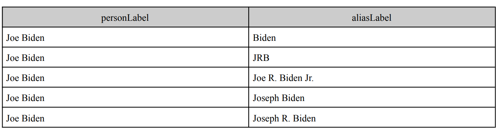

# What is this project about?
This project is about practicing two aspects.

1. Object Oriented Programming
2. Natural Language Processing.

The objective is as follows:
We will retrieve data from https://query.wikidata.org/ to retrieve two columns of data that represent the same name, but the first column will be the unified name and the second column will be the name written in different forms. For example my name, JaeHo Bahng, will be written on the first column and the second column could be names such as J. Bahng, Jaeho bang, JHo Bhang, and other forms of my name. The goal of this project is to create various algorithms that give us a quantified measurement that tells us how similar the second column and the first column is for each row. The goal is to increase recall since the precision of this dataset would always be 1. No matter what we guess, since column 1 will always be the positive answer, as long as a single row is predicted to be the same in the first and second column, precision will always be 1, and we will have to quantify recall to find the better algorithm.

### OOP aspect
This project will be focused on structuring classes and methods, being able to call them in like we would call in packages such as numpy or pandas, and utilizing argparse to allow users to customize what funcitons and thresholds they would like to use from the package.

### NLP aspect
We will be using a few NLP methods to compare the first and second column. The first would be just checking and exact match. If column one and two are the same then we would consider them the same name. Not a very sophistocated algorithm. Second would be the Jaccard distance, third would be levenshtein distance, fourth would be creating a tf-idf method using n-grams, and last would be using a pre-existing tf-idf method by spacy and comparing them with a cosine similarity. As mentioned earlier, users will be able to choose which methods to use along with other arguments such as the n in ngrams and thresholds for similarity.

# matcher.name_matcher.py
This package contains all the scoring methods that compare the Person label and the Alias label for each row to bring out a score of how similar the two strings are and a value of TRUE or FALSE depending on the score and the given threshold.
The methods that are available in the class are Jaccard, Levensthein, ExactMatch, tfidf, and Bonus. each method scores, and classifies whether the two strings are equal.
A class by the name of NameMatchScorer is the parent class for all the other classes, but the exact methods are defined only in the classes that are inherited.
There are three arguments that must be passed into the methods and one optional argument that is used for the tfidf method. The three mandatory arguments are the personLabel, AliasLabel, and threshold. The optional argument is ngrams which is only used for the tfidf method which requires a tuple of two integers where the first integer is less than the second integer. 

# utils.parse_tsv.py
The parse_tsv module is the module that iterates through each row of the tsv file and provides an output file with all the results added onto the original file. 

# bin.main.py
The main.py module is where all the classes come together where the user can input a number of arguments to get a result. 

To run the main.py file form the bin foler, the following arguments must be fed into the code 

-f : input file directory  
-o : output file directory  
-s : scoring algorithm  
-t : threshold  
-p : print first rows  
-e : evaluation print  
-m : methode  

Examples of how the main.py module may be used
python main.py -f ../../data/names.tsv -o ../../data/output_Exact.tsv -s Exact -t 0.5 -p Y -e Y -m f1   
python main.py -f ../../data/names.tsv -o ../../data/output_Jaccard.tsv -s Jaccard -t 0.5 -p Y -e Y -m f1   
python main.py -f ../../data/names.tsv -o ../../data/output_Leven.tsv -s Leven -t 0.5 -p Y -e Y -m f1   
python main.py -f ../../data/names.tsv -o ../../data/output_tfidf.tsv -s tfidf -t 0.5 -p Y -e Y -m f1   
python main.py -f ../../data/names.tsv -o ../../data/output_Bonus.tsv -s Bonus -t 0.5 -p Y -e Y -m f1   