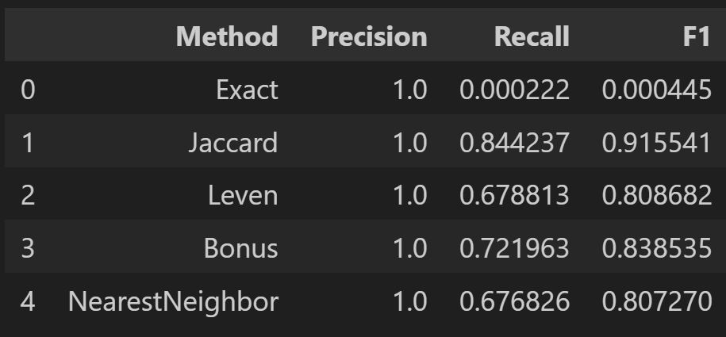
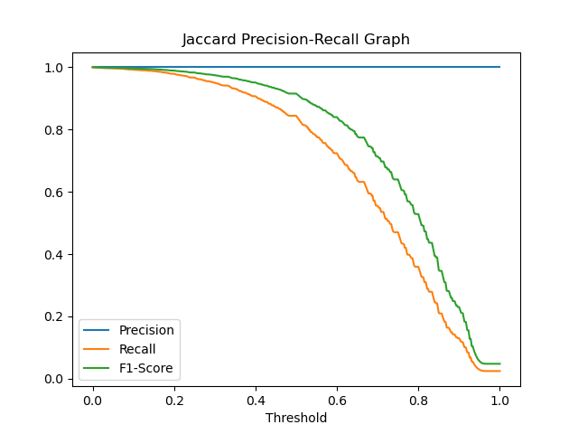
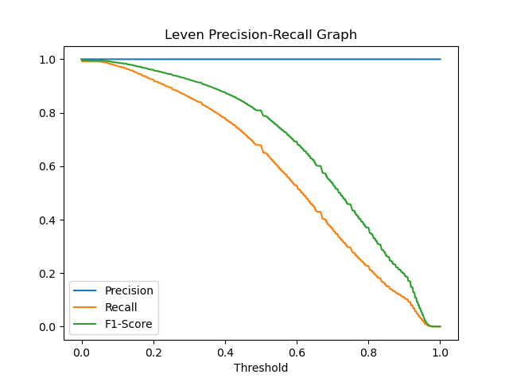

## B
{width=50%}
As mentioned in the instrucitons of the assignment, the precision is all equal to one. Because we are comparing the results to outcomes that are always true (the person label in the tsv file), we will never have an output where we thought it was true but is actually false. The Exact method had very low recall and F1 meaning that most of the names are not the same and are only similar. As of my understanding, the jaccard similarity is like a measure of similarity between sets by comparing their intersection over the union and levenshtein distance is calculating the minimum number of single-character edits required to change one string into the other. Since we can see that the Jaccard similarity has a higher recall and f1 score than the levenshtein distance, we can conclude that there are similarities in the intersection but take a long time for one string to be transformed to another probably because there are additional characters added to the original name.

## D
If the threshold is 1, it means that the two strings that we are comparing have to be a perfect match or basically the exact same. Therefore the scores will be almost identical to the ExactMatch function. The Precision will be 1, recall and f1 score will be very low. On the other hand, if the threshold is 0.01, it will consider almost all of the comparisons as correct. Therefore, the precision will be a 1 as usuall but the recall and f1 score will also be close to 1 becaues there will be almost no negatives. Since recall is the ratio of true positive against true positives and false negatives, having no negatives will make the metric close to 1. 

## E
{width=50%}
The image is the precision-recall curve for the Jaccard similarity thresholds. There is usually a trade-off between precision and recall depending on the thresholds and the optimal threshold is when the two curves intersect. However, since in our data, we can only have a precision of 1, it is hard to pinpoint an exact optimal threshold. However, based on the shape of the recall curve, we can imply that the optimal threshold will be some place between 0.45 and 0.65 or basically some place around 0.5.

## E
{width=50%}
The Precision-recall graph of the Levensthein graph is very similar in shape with the Jaccard graph. The difference woul dbe that because the Jaccard method is a better method than the Levensthein method, the graphs are a little lower in regard to the Y axis. Other than that, the same problem with the Jaccard graph which is the precision always being equal to 1 occurs so we can only guess the optimal threshold to be somewhere between 0.45 and 0.65 if this would be a real life situation.

## G(a)
1. Dimensionality Reduction: Using full names as tokens can result in a high dimensionality problem, especially when you have a large dataset with diverse names. The use of character n-grams (substrings of characters) can reduce the dimensionality of the feature space. This can make the TF-IDF matrix more manageable and improve the efficiency of your analysis.

2. Capture Substring Similarities: Character n-grams can help capture similarities between names that share common character sequences. For example, if you have names like "Alice" and "Alison," character n-grams can help identify that both names contain "Ali" as a common substring.

3. Flexibility in Matching: Character n-grams can provide more flexibility in matching names. For instance, if you're searching for "Bob" but your dataset includes "Bobby," using character n-grams allows you to find partial matches, which can be useful in fuzzy name matching.

4. Dealing with Variations: Character n-grams can handle variations in name spellings, such as nicknames or typos, which may not be captured using full name tokens.

## L(a)
The results of the algorithm of the bonus algorithm is labeled bonus in the results dataframe. The algorithm is similar to the tf-idf algorithm but it was done with a pre-built vectorizing function from the spacy library. Once the vector for both strings were calculated, I manually calcualted the cosine similarity of the two vectors to compute a similarity score. With threshold equal to 0.5, the algorithm performed better than the Levensthein algorithm but not as good as the Jaccard similarity. 

## L(b)
I attempted the multiprocessing library in many ways but it seemed to only make the process slower. The codes are in the main_multi.py file and possible reasons for the multiprocess making the process slower could be becaues the dataset itself is not big enough for the library to efficiently process. For example the Jaccard method took 0.9 seconds without multiprocessing and took 9 seconds with multiprocessing.